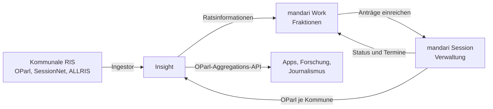

# Die Plattform im Überblick

mandari besteht aus drei Bausteinen, die alle auf denselben offenen Ratsinformationen aufsetzen. Jeder Baustein funktioniert für sich, gemeinsam entsteht ein durchgängiger Datenfluss von der Verwaltung bis zur Öffentlichkeit.

## Drei Bausteine

| Baustein | Für wen | Was er leistet |
|----------|---------|----------------|
| **Insight** | Bürgerinnen und Bürger, Presse, Forschung | Kostenloses Bürgerportal mit Volltextsuche über Vorlagen, Sitzungen und Beschlüsse vieler Kommunen. Beschlussverfolgung, Ratsfragen, Sitzungskalender, OParl-Aggregations-API. |
| **Work** | Fraktionen und politische Organisationen | Arbeitsbereich für Sitzungsvorbereitung, Fraktionssitzungen, Anträge, Aufgaben und Dokumente. Digitale Einreichung bei der Verwaltung, öffentliche Fraktions-API. |
| **Session** | Kommunale Verwaltungen | Ratsinformationssystem für den Sitzungsdienst: Gremien, Sitzungen, Vorlagen, Protokolle, Beschlusskontrolle, Sitzungsgelder, Fristen. Eigene OParl-Schnittstelle je Kommune. |

## Datenfluss

1. **Quellen**: Der Ingestor spiegelt die öffentlichen Daten angebundener Kommunen. Echte OParl-Schnittstellen werden direkt gelesen, andere Systeme über Scraper-Adapter oder Bridges angebunden (siehe [Quellen anbinden](betrieb/quellen-anbinden.md)).
2. **Session als Quelle**: Kommunen, die mandari Session nutzen, veröffentlichen ihre öffentlichen Daten per Knopfdruck ins Bürgerportal. Die eigene OParl-Schnittstelle je Kommune ist dabei die einzige Verbindung, nicht-öffentliche Inhalte verlassen den geschützten Bereich nie ([Veröffentlichung im Bürgerportal](session/buergerportal.md)).
3. **Work nutzt Insight**: Fraktionen sehen in Work die Ratsinformationen ihrer Kommune, bereiten Sitzungen vor und kommentieren Vorlagen.
4. **Work und Session**: Anträge werden digital eingereicht, Eingangsnummer, Bearbeitungsstatus und Beratungstermine fließen zurück ([Anträge digital einreichen](work/antraege-einreichen.md)).
5. **Nach außen**: Alles Öffentliche steht über die [OParl-Aggregations-API](insight/oparl-api.md) maschinenlesbar bereit.

## Grundprinzipien

- **Offener Standard**: OParl 1.1 ist die gemeinsame Sprache. Wir lesen ihn, wir sprechen ihn, und wir weichen nur mit klar gekennzeichneten Erweiterungen im Namensraum `mandari:` davon ab.
- **Nur Öffentliches wird öffentlich**: Jede Schnittstelle nach außen filtert serverseitig auf als öffentlich gekennzeichnete Inhalte. Das ist durch automatische Tests abgesichert.
- **Mandantentrennung**: Organisationen und Kommunen sind strikt voneinander isoliert. Sensible Felder sind mit mandantenspezifischen Schlüsseln verschlüsselt ([Datenschutz](datenschutz/index.md)).
- **Open Source**: Der Code ist unter einer Open-Source-Lizenz veröffentlicht und kann vollständig selbst betrieben werden ([Betrieb](betrieb/index.md)).
- **Rücksicht auf Quellen**: Unser Crawler hält sich an robots.txt, drosselt sich selbst und pausiert bei Störungen ([Crawler und Opt-out](datenschutz/crawler.md)).

## Begriffe

Rat, Gremium, Vorlage, Beratung, Tombstone: Die wichtigsten Begriffe aus OParl und mandari erklärt das [Glossar](glossar.md).
